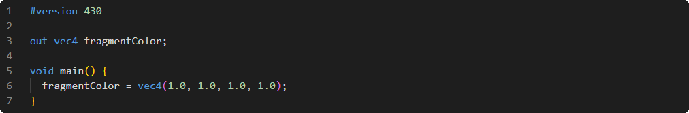

# Shader de fragment

Dernier shader programmable du processus, quasi toujours utilisé malgré qu'il ne soit pas obligatoire.

## Sortie

La sortie implicite principale à ce shader est la première variable déclarée en sortie.

## Exemple

 
