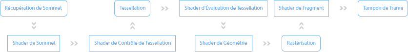

# Shaders

Les shaders sont de petits programmes indépendants qui communiquent entre eux à partir de paramètres en entrée et en sortie.

## Processus

De façon simplifiée, le processus des shaders est le suivant:

 

*Les boîtes aux coins arrondies sont gérées par la librairie graphique, tandis que les boîtes aux coins à angle droit sont programmables.*
