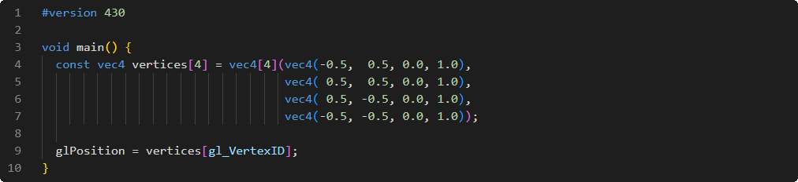

# Shader de sommet

Premier shader programmable du processus, et le seul obligatoire dans cette catégorie:

 

*L'exemple ci-dessus est pédagogique et ne réflète pas nécessairement de bonnes pratiques.*

